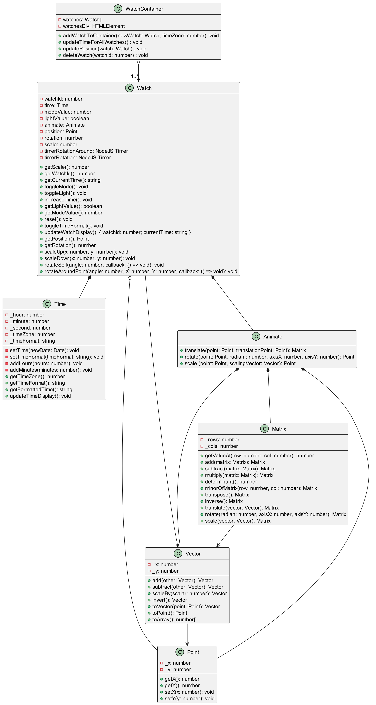
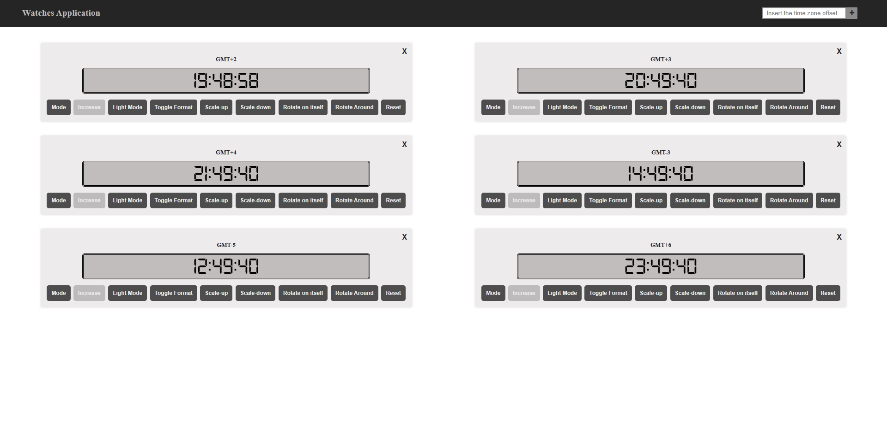
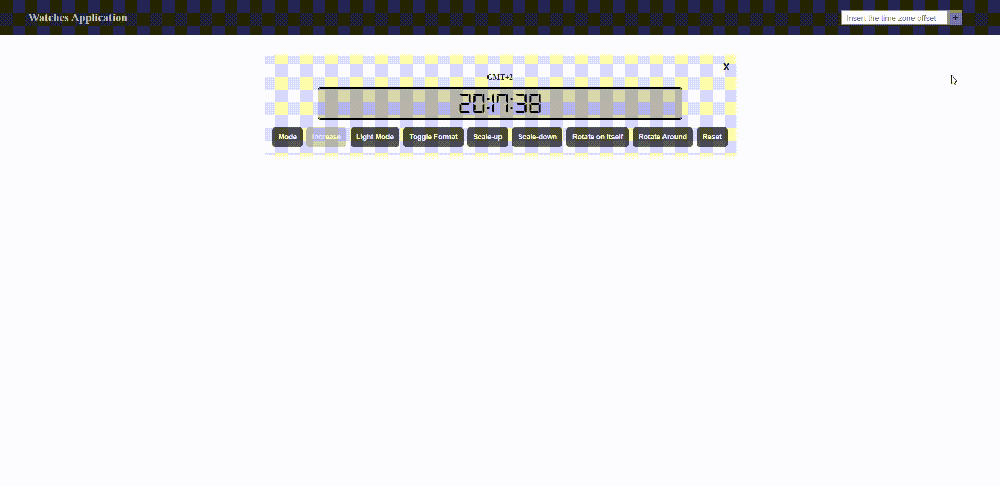

# GE test

## Project Instructions:
### A. Create a watch that works as follows:
- Displays the current time
- A button “mode” allows to change time
- When pressing the “mode” button, the time is editable: the “increase”
button adds one hour
- When pressing the “mode” button again, the “increase” button adds one minute
- When pressing the “mode” button a third time, the time is no more
editable: the “increase” button does nothing
- The button “light” turns on the screen to be readable even at night
- Create a class diagram
- Implement the described workflows, with any language or tool

### B. Additional features:
- Display multiple clocks in the page
- Each clock shall display a different time zone (ex: GMT+1, GMT+2…)
- Add a reset button to reinitialize a clock after using the edit button
- Add a button that dynamically creates and displays a new clock (extra bonus if you can choose the time zone before creating it)
- Add a button to change the display between 24h and AM/PM format
- Extend the class diagram

### C. Watch animation
- Implement a set of classes to provide:
  - 2d vector/point coordinate
  - 3x3 matrix and functions associated to it:
    - Inverse
    - Multiply
    - Transform point/vector
  - Functions to create translation/rotation/scaling matrix
- Leverage this library to animate the watch position by combining a set of matrices:
The watch shall rotate on itself, scale up and down, and rotate around an arbitrary point (randomly defined at page load or from a user input field)
- Extend the class diagram

## Project Class Diagram



## Screenshot

<<<<<<< HEAD


# Application demo


=======


# Application demo


>>>>>>> ea6c24b2d1e54cd0640aed05506d52ea3cd34b06

## Instal & Run Project
```javascript
npm install
npm run build
npm run start
```
